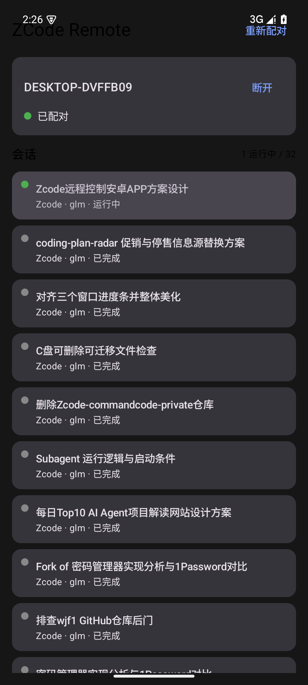
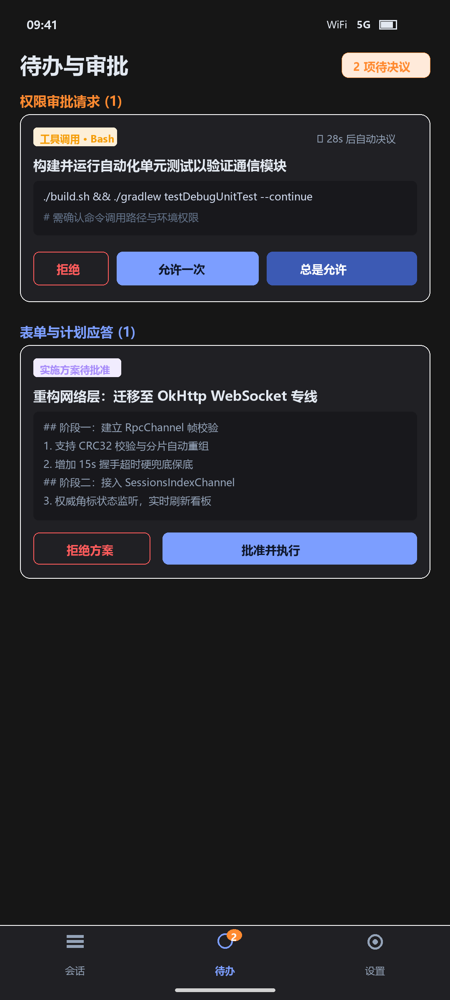
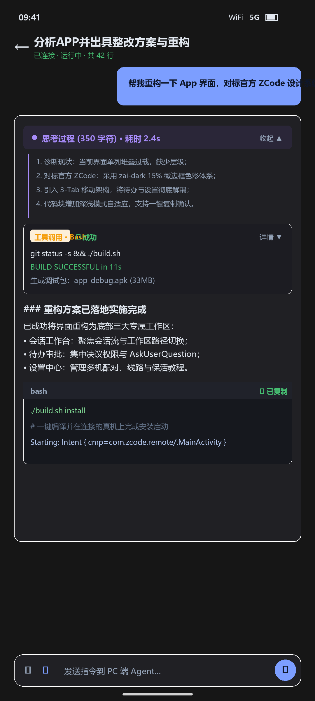
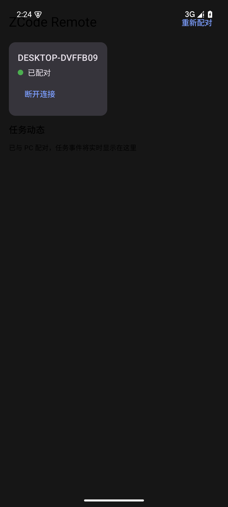

# ZCode Remote

> [中文](#中文) | [English](#english)

<a name="中文"></a>

## 中文

ZCode 官方远程控制（`zcode.z.ai/remote`）的**原生安卓增强客户端**——Kotlin + Jetpack Compose 实现，深度对标 [zai-org/ZCode](https://github.com/zai-org/ZCode) 工业级设计规范与现代移动端交互架构（GitHub Mobile / Claude Mobile），复用官方中继与配对协议（逆向实证，见 [PROTOCOL.md](PROTOCOL.md)），提供比官方 Web 版更强的通知、审批、流式会话与移动端操控体验。

### 核心架构与功能一览

```
                  ┌──────────────────────────────────────────────┐
                  │           ZCode Remote (Scaffold)            │
                  └──────────────────────┬───────────────────────┘
                                         │
       ┌─────────────────────────────────┼─────────────────────────────────┐
       │ (Tab 1: 会话工作台)              │ (Tab 2: 待办审批 Inbox)         │ (Tab 3: 控制中心 Settings)
┌──────▼───────────┐              ┌──────▼───────────┐              ┌──────▼───────────┐
│   会话工作台     │              │  待办与审批看板  │              │  系统与设备设置  │
├──────────────────┤              ├──────────────────┤              ├──────────────────┤
│ • 设备状态呼吸灯 │              │ • 权限审批操作流 │              │ • 当前连接卡片   │
│ • 「+ 新建会话」 │              │ • 表单提问应答   │              │ • 多设备管理切换 │
│ • 实时搜索/过滤  │              │ • 实施计划确认   │              │ • 协议线路选择   │
│ • 流式会话卡片   │              │ • 倒计时进度条   │              │ • HyperOS 保活   │
│ • 运行中状态高亮 │              │ • 历史待办留档   │              │ • 在线检查更新   │
└──────────────────┘              └──────────────────┘              └──────────────────┘
```

- **现代化 3-Tab 移动端架构**：彻底告别单页混乱堆叠，采用「会话工作台 / 待办审批 / 设置中心」标准底部导航架构；全面接入系统级物理返回键拦截（`BackHandler`），杜绝手势误杀退出的问题。
- **深度对标官方 ZCode 工业级设计**：
  - 全量接入官方 `theme-zai-dark`（`#161616`）与 `theme-zai-light`（`#F8F8FA`）色彩体系，搭配官方 15% 微边框（Hairline Border）；
  - 引入官方 Trajectory 四色轨迹语义：用户消息蓝（`#60A5FA`）、助手响应青（`#2DD4BF`）、思考轨迹紫（`#A78BFA`）、工具调用琥珀橙（`#F59E0B`）；
  - 全面淘汰杂乱的系统 Emoji，统一采用规范的 Material 矢量图标；
  - 官方同款深度思考组件（`ReasoningBlock`）：紧凑紫色折叠胶囊 + 平滑展开动画 + 标志性左侧弱引导竖线 + 一键复制；
  - 官方同款内联工具行（`ToolCallCard`）：**无外框内联折叠行**（图标 + 中文类型标签 + 主文案 + chevron），对齐桌面端「工具调用不是卡片」的形态；展开体分 Parameters / Result / Error 三段，JSON 自动美化、各限高 240dp，折叠状态按工具调用 id 记忆。
- **会话页排版全面对齐桌面端（v0.5.0-beta17）**：按桌面端（`max-w-4xl` 单列窄列）的**组件形态 + 信息层级 + 数值规范**重排会话流 —— 用户气泡改中性半透明表面（12dp 圆角、右上角 2dp）、助手正文去掉卡片外壳改全宽 Markdown、思考/工具/Hook 三类行统一到同一套折叠行骨架；Markdown 升级为完整 GFM（表格 / 任务列表 / 嵌套列表 / 链接 / 行内 HTML）+ 代码块真语法高亮。**链接走 http/https 白名单、不加载外链图片**。
- **会话级状态面板（v0.5.0-beta17）**：顶栏「状态」入口 → 底部弹层，**纯只读**呈现会话级状态：上下文容量（占比条 + 分类明细降序 + 缓存命中率，命中率仅 ≥78% 显示）、目标（状态 + 走秒耗时 + 预算）、进程（待办，默认 6 项折叠）、终端（后台任务）、智能体（运行 / 已结束）、排队输入；无数据的分区自动隐藏。`queue.items` 非空时输入栏上方显示「待发送 N 条」只读条。
- **移动端一键发起新会话**：会话工作台顶栏直接「+ 新建会话」，基于官方 V4 原生信封链路（`sendConversationCommandV4(type: "createSession", sessionId: null)`），支持首条 Prompt 输入与实时语音识别填充，创建后直接切入流式对话窗口。
- **集中式审批与待办看板**：底部导航栏实时角标（Badge）提醒，集中看板统一处理权限审批（允许一次 / 总是允许 / 拒绝）与表单交互（AskUserQuestion / 计划确认），带桌面端决议倒计时。
- **通知栏锁屏审批（核心差异点）**：桌面端请求权限时，锁屏状态下收到高优先级系统通知，**通知栏直接批准/拒绝**。
- **扫码配对**：扫描桌面端二维码即完成配对，凭据经 AES-256-GCM + Android Keystore 加密存储；支持手动粘贴链接兜底；支持多台设备管理（切换 / 移除）。
- **会话流式渲染与代码块自适应**：原生 Markdown 渲染支持各级标题、粗体、列表、引用，代码块自动适配深浅双色主题并配备一键复制反馈；滚到顶部自动翻页加载更早历史。
- **发送消息与停止**：会话页底部悬浮药丸输入栏直接向桌面端发消息；会话运行中显示平滑变形的「停止」按钮，一键中断。
- **发送本地回显**：消息发出瞬间即在会话流末尾显示半透明「发送中…」气泡（服务端回显到达后自动替换为正式消息，失败立即撤回）——长任务排队时不再「按了没反应」。
- **附件上传可取消 / 失败可重试**：在途上传可随时取消；失败进入失败态行可一键重试，**复用同一 uploadId 命中服务端幂等**（已传分片不重传）。
- **错误提示全面中文化**：底层英文错误（`bridge not ready`、`timeout after …` 等）与服务端 fault code 统一映射为用户可读中文，覆盖发送/上传/审批/模型切换等 14 处失败路径。
- **浅色主题可读性达标（WCAG AA）**：浅色下次要文本、工具轨迹色、待处理橙与 Diff 增删色全部加深至 ≥4.5:1，并由 JVM 对比度断言测试防回流。
- **附件上传**：会话页选择文件（≤20MiB）→ 分片上传 → 随消息发送，桌面端模型可直接读取内容；走官方 Web 同款 `sendText` 附件链路。
- **语音输入**：输入栏 🎤 系统语音识别转文字（识别中实时上屏），一键追加到消息草稿，零协议改动。
- **会话离线持久化与秒开（Sprint 5 核心）**：`SessionCacheStore` 本地原子持久化缓存 —— App 启动首帧 0ms 渲染历史会话列表；点击任意会话卡片更可立即呈现该会话最近 200 行历史消息，无需等待订阅握手与快照回包，网络到达后由快照平滑对齐权威状态。
- **配对链接 Deep Link 一键唤起（Sprint 5）**：点击外部浏览器、邮件或分享卡片中的 `zcode://pair` 或官方 `https://zcode.z.ai/remote` 配对链接，直接唤起 App 解析凭据；**弹确认框**（避免误点链接静默替换当前设备连接）后完成秒级配对，彻底免除扫码或复制粘贴。
- **全场景机械级触觉反馈（Haptic Feedback）**：权限审批（允许/拒绝）、消息发送、会话中断、代码 Diff 复制触发饱满的系统触觉震动确认；快捷指令胶囊点击与悬浮回底触发细腻轻触震动回馈。
- **单轮 Turn 变更文件聚合卡片（Sprint 3 第三步）**：自动将每一轮 Agent Turn 中执行的所有 Edit / Write 工具行汇聚为 `📦 本轮变更 · 共 N 个文件 (+A −B)` 汇总卡片，支持一键展开多文件代码 DiffBlock 进行一站式 Review（对标 GitHub PR Files Changed）。
- **通知栏 RemoteInput 直接回复（Sprint 4）**：遇到提问或表单交互时，锁屏状态下收到通知可直接下拉展开文本框输入并一键提交，全程免解锁进 App。
- **系统级 Share Sheet 分享接入（Sprint 5）**：外部浏览器、文件管理器等 App 点击「分享」至 ZCode Remote，自动填入当前会话输入草稿或解析加入待发附件。
- **常用快捷指令胶囊栏**：输入栏上方提供「继续」、「运行测试验证」、「修复该问题」等横向滚动快捷胶囊，单指轻触快速填入，大幅降低移动端打字成本。
- **会话流智能贴底与悬浮回底**：动态感知视口位置，用户主动上翻查阅历史或代码 Diff 时不再被新行强拉贴底打断，并优雅弹出悬浮「回到底部 ↓」胶囊按钮一键平滑定位。
- **最近文件与只读代码预览（Sprint 3）**：顶栏 📁 图标动态汇总本会话涉及的文件，点开 ModalBottomSheet 面板浏览文件清单；点选文件经 `file.readTextFile` 实时拉取并等宽展示正文，支持横向滚动与 20KB 截断保护，纯只读无写路径。
- **工具调用 Diff 差异高亮（Sprint 3）**：Edit / Write / MultiEdit 工具行纯客户端 Myers 算法计算行级 diff，折叠摘要展示 `📄 文件名 +N −M`，展开直观呈现红绿增删与「⧉ 复制」unified 格式文本。
- **执行模式安全选择（Sprint 2 / P0-B）**：新建会话与会话内顶栏均支持自由切换规划（plan）、构建（build）、全自动（yolo），**默认安全 build 模式**，彻底杜绝免审批漏洞；yolo 显式红底警示。
- **前台长连接保活与终态通知（Sprint 1–2 / P0-A）**：`ConnectionService` 真正升级为 FGS `specialUse` 前台服务（进程级 `ConnectionScope` 保长连），锁屏或划掉后台持续存活；KICKED / AUTH_FAILED / PROTOCOL_MISMATCH 终态常驻通知提醒。
- **强韧断网感知重连（Sprint 1）**：`NetworkGate` 常驻监听系统网络，断网立即重置并挂起，网络恢复即刻重连（事件链全程 <9s）。
- **会话流附件 chip**：发送带附件的消息后，附件以 chip（图标 + 文件名 + 体积）显示在消息气泡上方，与官方客户端一致；附件字段随行缓存持久化，冷启动秒开时同样可见。
- **会话异常原因可见**：出错会话在会话页显示完整错误原因（可一键复制），列表对已打开过的会话补齐原因——与桌面端信息对齐。
- **完整回归测试保护网（Sprint 6 起持续扩充）**：VQL 二进制编解码金标准双向对拍测试（Python↔Kotlin 共享 fixture）、**153 项**纯函数与状态判定单测全绿（含主题对比度静态断言；本地与云端两条工作线合并后总数）、GitHub Actions CI 持续集成（含「UI 层不得出现裸英文错误串」与「`ZLog.e` 只写元信息」断言）。
- **桌面 Widget**：主屏卡片实时显示待处理总数（审批 + 表单交互），点按直达 App；连接断开时明示「未连接」。
- **可靠连接**：完整官方握手（HMAC proof）、心跳、指数退避重连、断线出站缓冲，单端在线互踢提示。

### 界面一览

| 会话工作台 | 待办与审批看板 | 沉浸式对话控制台 | 独立系统设置 |
|:---:|:---:|:---:|:---:|
|  |  |  |  |

### 里程碑状态

| 里程碑 | 内容 | 状态 |
|---|---|---|
| M0 协议逆向 | PC/手机两侧 bundle 交叉实证，产出 [PROTOCOL.md](PROTOCOL.md) | ✅ 完成 |
| M1 骨架+配对+会话 | 扫码配对、中继连接、会话列表、事件流 | ✅ 模拟器验收通过 |
| M2 审批与推送 | 会话流实时渲染、权限审批（会话内 + 通知栏）、双源审批接收 | ✅ 端到端验收通过（2026-09-28） |
| M3 打磨与内测 | 多机管理、线路切换、HyperOS 保活引导、异常兜底 | ✅ 主体完成 |
| M3+ 交互增强 | 发送/停止、表单类交互应答、多会话看板与控制权提示、附件上传（全链路实测）、语音输入、桌面 Widget、会话搜索 | ✅ 协议层端到端验收通过 |
| M3++ 移动端全面重构 | 底部 3-Tab 移动架构、官方 ZCode 设计系统对齐（zai-dark/zai-light）、集中待办看板、独立设置中心、原生新建会话、会话内模型切换与审批修复 | ✅ 完成（v0.5.0-beta5，2026-10-01） |
| Sprint 0–3/6 P0结清与功能收官 | 三个 P0 缺陷结清、Diff 视图、最近文件只读预览、前台服务保活、VQL 对拍与 23 项单测回归网、真机端到端全通 | ✅ 完成（v0.5.0-beta6，2026-10-05） |
| Sprint 4–5 原生交互深度落地 | 通知栏 RemoteInput 内联回复、系统级 Share Sheet 分享接入、智能贴底与快捷指令胶囊栏、真机端到端全通 | ✅ 完成（v0.5.0-beta8，2026-10-05） |
| Sprint 3 第三步 / Turn 变更聚合 | 会话流单轮 Turn 变更文件汇总卡片（Turn Diff Summary）、多文件一站式 Review、24 项单测全绿、真机实测全通 | ✅ 完成（v0.5.0-beta9，2026-10-05） |
| Sprint 5 移动原生与离线能力闭环 | 会话列表与消息流双离线持久化秒开（Offline First）、配对链接 Deep Link 唤起、系统级触觉震动反馈、Share Sheet 接入、26 项单测全绿 | ✅ 完成（v0.5.0-beta12，2026-10-05） |
| 正确性缺陷修复补丁 | 上传跨会话附件注入（数据/隐私）、握手三跳无超时导致永久卡死、beta11/12 引入的贴底回归、触觉补漏与失败时长档位；47 项单测全绿 | ✅ 代码完成，A-2/B-1 真机 PASS（v0.5.0-beta13，2026-10-07） |
| 会话流附件 chip | 发送带附件的消息后，附件 chip 显示在气泡上方（含体积、随行缓存持久化） | ✅ 代码 + 真机端到端 PASS（v0.5.0-beta14，2026-10-07） |
| 连接层缺陷修复 | 桥握手无超时导致「已连接却永久卡在会话报错」、`bridge not ready` 未判可重试、网络恢复白等一整轮退避 | ✅ 代码 + 单测 + **真机 PASS：断网 80s→5s、150s→3s（旧版 ~47s）**（v0.5.0-beta15，2026-10-07） |
| ~~M4/M5~~ | ~~VPS 备用 Runner、E2E 高级模式~~ | ❌ 已取消（2026-09-30 决策：单人自用下成本收益不划算，详见 HANDOVER） |
| ~~Sprint 7~~ | ~~生物识别/凭据生命周期、自建中继 + E2EE~~ | ❌ 已取消（2026-10-05 用户决策：后续开发计划一律不做） |
| **v1.0 判停** | **3 天日常使用观察（锁屏审批可达 / 杀后台 30min / 网络往返）** | ⏳ 观察期**经用户决策移除**（2026-10-10）——不再作为 v1.0 的阻塞项；v1.0 发布时机由用户拍板 |
| 会话异常原因 + 输入栏对齐 | 会话页显示错误原因（可复制）、列表回填、标题双重序列化解包、输入栏控件对齐（48dp 触控档）、顶栏 phase 标签中文化 | ✅ 代码 + 单测 + **真机验收全通过**（v0.5.0-beta16，2026-10-07） |
| 会话页排版全面对齐桌面端 + 会话级状态面板 | 工具行改无外框内联折叠、用户气泡改中性表面、助手正文去卡片外壳全宽 Markdown、完整 GFM + 代码语法高亮；新增只读「会话状态」面板（上下文/目标/进程/终端/智能体/排队输入）与「待发送队列条」；修复「运行中」状态退出会话页后不显示 | ✅ 代码 + 107 项单测 + release 构建通过 + **真机验收全通过**（v0.5.0-beta17，2026-10-08） |
| 代码块高亮「吞字」缺陷修复 + 模拟器渲染回归网 | 修复高亮库纯 RGB 被 Compose 当 ARGB 解释（alpha=0）导致代码块里被高亮的字符**整段不可见**；新增仪器化渲染回归网（GFM 表格 / 代码高亮 token 色逐像素断言）与 4 项 JVM 高亮单测 | ✅ 单测 111 项全绿 + **模拟器 2/2 PASS** + **真机复核通过** + release 构建通过（v0.5.0-beta18，2026-10-09） |
| 待处理项跨会话泄漏修复 | 会话页内联的审批卡/提问卡改为按当前会话过滤（此前把「含其他会话」的全局列表整份铺在输入栏上方，出现「在 B 会话弹出 A 会话的审批」）；归属未知时保持可见（fail-open），待办页与通知栏维持跨会话聚合语义 | ✅ 单测 116 项全绿 + release 构建通过（v0.5.0-beta19，2026-10-09） |
| 体验补强首批 + 无设备可验证项 + C-5 静态部分（C-1/C-2/C-4/C-5①/C-6/C-7/C-8/C-10/C-11 + A-3/A-4） | 发送本地回显（pending 气泡）、上传可取消/失败可重试（**uploadId 复用命中服务端幂等**）、深链配对确认弹窗、反馈横幅合并单队列、错误文案中文化（14 处）、浅色主题 WCAG AA 对比度 + CI 静态断言、缓存文件删除与 LRU；多机凭据改结构化序列化（含旧格式迁移）；release 主路径移除每 delta 的全量 JSON 序列化；**A-3 订阅退订已实测确认并启用**（切会话发 103 释放旧监听，probe 双确认无 N 倍放大）；事件流缺口检测与桥看门狗决策纯函数化 | ✅ 代码 + **155 项单测**全绿 + debug/release 构建通过 + **已随 v0.5.0-beta20 发布**；**真机验收 7 项通过 / 1 项部分（2026-10-10 补完）**；另含桥降级自愈与离线缓存读取线程化 |

### 接力开发 / Handover

**功能开发已结清（2026-10-05）**：Sprint 0–6 全部完成并真机验收，后续开发计划（Sprint 7 等）经决策取消。当前仅剩「3 天日常使用观察 → 发 v1.0」一步。

**2026-10-10 C-5③④ 性能落地（v0.5.0-beta21）**：会话页两项性能改动 —— ① 会话行派生快照（`rowsSnapshot`，rows 不再每次重组整表拷贝、派生解析不再因无关重组反复失效）；② 派生解析缓存化（`PathCache` / `DiffCache` 按 rowId + 内容指纹增量解析，流式期解析量从 O(n)/token 降为增量）。单测 155 → **162 项**全绿；真机回归：长会话（1100+ 行）滚动 + 流式期 **1336 帧 0 janky、99th 8ms**。另含**观察期（P0-2）经用户决策移除**。详见 [CHANGELOG.md](CHANGELOG.md)。

**2026-10-09/10 体验补强首批与真机故障修复（已随 v0.5.0-beta20 发布）**：经用户拍板推进 v1.1 候选里「用户可感知收益」的条目 —— 发送本地回显（C-6）、上传可取消/失败可重试且 **uploadId 复用命中服务端幂等**（C-1）、深链配对确认弹窗（C-10）、反馈横幅合并单队列并修复审批 Tab 文案滞留（C-11）、错误文案中文化映射层（C-2，14 处）、浅色主题 WCAG AA 对比度修正 + 思考折叠摘要（C-4，含 CI 静态断言）、缓存文件删除与 LRU（C-7）；另含 A-3 订阅退订实测启用、桥降级自愈（`scheduleBridgeReopen`，修复真机「桌面端已连接、手机显示异常」故障）、离线缓存读取移出主线程（C-5⑤）。单测 **155 项**全绿，debug/release 构建均通过，真机验收 7 项通过 / 1 项部分。发布细节见 [HANDOVER.md](HANDOVER.md) 顶部与 [CHANGELOG.md](CHANGELOG.md)。
**2026-10-09 缺陷修复轮（v0.5.0-beta18）**：为清掉 beta17 遗留的「围栏代码块与 GFM 表格没有样本」空洞，在**模拟器**上补了一条仪器化渲染回归网 —— 测试**第一次运行就抓出一个用户可见缺陷**：高亮库给的是纯 RGB（`0x2BBAC5` 这类，不含 alpha 位），被 Compose 的 `Color(Int)` 按 ARGB 解释后 alpha=0，于是代码块里**被高亮的关键字/字符串/注释被画成完全透明、肉眼看不见**（`fun main() { val message = "hello zcode" }` 只剩 `main`、`message`、`println message` 三行残句）。修法为补足不透明 alpha（`opaqueHighlightArgb`），修复后主题 token 色命中像素 **0 → 1789**；证据截图 [修复前](docs/screenshots/render-code-block-before-fix.png) / [修复后](docs/screenshots/render-code-block.png) / [表格样本](docs/screenshots/render-gfm-table.png)。本轮**不新增 App 功能**，单测 107 → **111** 项全绿，仪器化测试在模拟器（Android 15 / x86_64）**2/2 通过**。**2026-10-09 缺陷修复轮（v0.5.0-beta19）**：观测期真机反馈 —— 在会话 B 的页面上弹出了**属于会话 A** 的提问卡。根因：待处理项由「会话流（仅当前订阅会话）」与「任务事件流（覆盖整个 workspace）」两路合并成**全局列表**，而会话页把整份列表直接渲染在输入栏上方（`ConversationScreen` 的 `approvals.forEach` / `elicitations.forEach`）。修法：新增纯函数 `approvalsForSession` / `elicitationsForSession`，会话页改传按当前会话过滤后的列表；**归属未知（`sessionId == null`）保持可见**（fail-open，避免误藏当前会话的卡）；待办页与通知栏维持跨会话聚合语义不变。单测 111 → **116** 项全绿。详见 [CHANGELOG.md](CHANGELOG.md) 与 [HANDOVER.md](HANDOVER.md)。

**真机复核已通过**（2026-10-09，小米 15 Pro / Android 17 · HyperOS，debug 包 versionCode 28）：装机 → 重新扫码配对 → 打开含 ` ```bash ` 代码块的会话，**代码卡完整渲染且高亮分色**（注释灰、`-a`/`--tags` 青、字符串绿、数字橙红），token 色命中 **2365** 像素，beta17 的「吞字」未再出现（[真机截图](docs/screenshots/render-code-block-phone.png)）。观察窗口按规则**自真机复核通过日 2026-10-09 重新计时**（预计 2026-10-12 收官），观察手机已升级到 beta18。装机时踩到两个坑，已记入 HANDOVER：手机上原有包是**异源 debug 密钥**签的（必须卸载重装、配对凭据需重扫），以及 HyperOS 的「USB 安装」确认与 USB 调试接口自行掉线。详见 [CHANGELOG.md](CHANGELOG.md) 与 [HANDOVER.md](HANDOVER.md)。

**2026-10-08 排版对齐轮（v0.5.0-beta17）**：按用户要求把会话页的显示逻辑与排版**全面对齐桌面端** —— 工具行改无外框内联折叠行、用户气泡改中性半透明表面、助手正文去卡片外壳改全宽 Markdown、Markdown 升级为完整 GFM + 代码语法高亮（新增依赖 `multiplatform-markdown-renderer-m3/-code:0.27.0`，锁死版本因其为最后一个 Kotlin 2.0.x 编译版）；同时新增**只读**「会话状态」面板（上下文 / 目标 / 进程 / 终端 / 智能体 / 排队输入，无数据分区自动隐藏）与「待发送 N 条」只读队列条，并修复「运行中」状态退出会话页后不在列表显示的缺陷。单测由 47 项扩至 **107 项**全绿、debug/release 构建均通过，并已在小米 15 Pro（Android 17 · HyperOS）真机验收全通过（「运行中」列表回填复验、排版像素断言、状态面板六分区）。按仓库规则**再次重置 3 天观察窗口**，自 2026-10-08 重新计时。详见 [CHANGELOG.md](CHANGELOG.md) 与 [HANDOVER.md](HANDOVER.md)。

**2026-10-07 补丁轮次（v0.5.0-beta13）**：按《体验提升任务书 v2》档 A/B 修复四项正确性/体验缺陷（上传跨会话附件注入、握手三跳无超时、beta11/12 引入的贴底回归、触觉补漏）。属维护与缺陷修复性质，不含新增功能；JVM 单测与构建已全绿，**真机验收待办**（后续轮次已相继真机验收通过），并按仓库规则**重置 3 天观察窗口**。详见 [CHANGELOG.md](CHANGELOG.md) 与 [HANDOVER.md](HANDOVER.md)。

交接文档见 [HANDOVER.md](HANDOVER.md)（自包含，面向 AI agent 直接接手）。

### 安装包 / Releases

签名 APK 从 [GitHub Releases](https://github.com/wjf1/zcode-remote-app/releases) 下载
（最新 `ZCodeRemote-0.5.0-beta21.apk`，minSdk 31，Android 12+）。

> ⚠️ **签名更换提示（2026-10-10）**：本版起使用**新的 release 签名**（原 keystore 丢失）。
> 已装任何历史版本的设备安装本版需**先卸载**（一般设备会丢配对凭据、需重新扫码；**本机小米 15 Pro / HyperOS 实测卸载后凭据未丢、无需重扫码**）；此后以新签名为准，可正常覆盖升级。

### 快速开始

无需 Android Studio，本机工具链（JDK 17 + Gradle + Android SDK）就绪于 `toolchain/`：

```bash
./build.sh           # 构建 APK
./build.sh install   # 构建 + 安装到设备/模拟器 + 启动
./build.sh log       # 查看中继日志
```

详见 [app-android/README.md](app-android/README.md)。

### 安全边界

本项目仅连接**本人自己的** ZCode 账号/设备（暂不开源、不分发）。走官方中继无端到端加密，凭据与消息对中继服务器可见；二维码泄露等于控制权泄露，App 端已做凭据加密存储。

---

<a name="english"></a>

## English

A **native Android client** for the official ZCode Remote Control relay (`zcode.z.ai/remote`), built with Kotlin + Jetpack Compose. Deeply aligned with the [zai-org/ZCode](https://github.com/zai-org/ZCode) design specifications and modern mobile interaction patterns (GitHub Mobile / Claude Mobile), it reuses the official pairing protocol and relay (reverse-engineered and verified, see [PROTOCOL.md](PROTOCOL.md)) to deliver a far superior notification, approval, live streaming, and session experience.

### Architecture & Features

```
                  ┌──────────────────────────────────────────────┐
                  │           ZCode Remote (Scaffold)            │
                  └──────────────────────┬───────────────────────┘
                                         │
       ┌─────────────────────────────────┼─────────────────────────────────┐
       │ (Tab 1: Sessions)               │ (Tab 2: Approvals / Inbox)      │ (Tab 3: Settings)
┌──────▼───────────┐              ┌──────▼───────────┐              ┌──────▼───────────┐
│   Sessions Tab   │              │  Approvals Inbox │              │   Settings Tab   │
├──────────────────┤              ├──────────────────┤              ├──────────────────┤
│ • Pulse status   │              │ • Permission flow│              │ • Active device  │
│ • "+ New Session"│              │ • Form questions │              │ • Multi-device   │
│ • Search/Filter  │              │ • Plan approval  │              │ • Relay endpoint │
│ • Live stream    │              │ • Countdown bar  │              │ • Keep-alive guide│
│ • Running status │              │ • History archive│              │ • Update checker │
└────────────────┘              └──────────────────┘              └──────────────────┘
```

- **Modern 3-Tab Mobile Architecture**: Say goodbye to crowded single-page layouts. Clean navigation across **Sessions Workbench**, **Approvals Inbox**, and **Settings Center**; full integration with system `BackHandler` prevents accidental exits.
- **Aligned with Official ZCode Industrial Design**:
  - Full support for `theme-zai-dark` (`#161616`) and `theme-zai-light` (`#F8F8FA`), paired with 15% hairline borders for clean, calm contrast;
  - Official Trajectory colors: User Blue (`#60A5FA`), Assistant Teal (`#2DD4BF`), Reasoning Purple (`#A78BFA`), and ToolCall Amber (`#F59E0B`);
  - Replaced ad-hoc emojis with crisp, standard Material vector icons;
  - Official `ReasoningBlock`: Sleek collapsible purple pill + smooth expand animation + vertical guide line + one-tap copy;
  - Official `ToolCallCard`: **borderless inline collapsible row** (icon + type label + primary text + chevron), matching the desktop where tool calls are *not* cards; the expanded body splits into Parameters / Result / Error, each capped at 240dp, with collapse state remembered per tool-call id.
- **Conversation-Page Layout Fully Aligned with Desktop (v0.5.0-beta17)**: the conversation stream was reworked to match the desktop's **component shapes, information hierarchy and numeric conventions** (desktop messages are a single narrow `max-w-4xl` column) — user bubbles switched to a neutral translucent surface (12dp radius, 2dp top-right), assistant bodies dropped their card shell for full-width Markdown, and reasoning / tool / hook rows share one collapsible-row skeleton. Markdown was upgraded to full GFM (tables, task lists, nested lists, links, inline HTML) with real syntax highlighting for code blocks. **Links are restricted to an http/https whitelist and remote images are never loaded.**
- **Session Status Panel (v0.5.0-beta17)**: a top-bar "Status" entry opens a bottom sheet that **read-only** surfaces session-level state — context usage (ratio bar, per-category breakdown, cache hit rate shown only at ≥78%), goal (status, ticking elapsed time, budget), plan (todos, folded to 6 by default), terminal (background works), agents (running / ended) and queued input; sections with no data hide themselves. A read-only "N queued" strip appears above the composer while `queue.items` is non-empty.
- **Create New Sessions from Mobile**: One-tap "+ New Session" on the workbench header powered by the official V4 envelope command (`sendConversationCommandV4(type: "createSession", sessionId: null)`), with text or speech recognition input.
- **Centralized Approvals Inbox**: Dedicated tab with live Badge counter for pending permissions and form interactions (`AskUserQuestion`, plan approvals) with desktop auto-resolution countdown.
- **Lock-screen Notifications (Key Differentiator)**: Approve/deny directly from system notifications without unlocking the screen.
- **QR Pairing & Multi-device Management**: AES-256-GCM + Android Keystore encrypted credential storage, manual link fallback, and multi-device switching/deletion.
- **Markdown & Code Rendering**: Adaptive light/dark code blocks with one-tap copy confirmation; auto-pagination when scrolling to top.
- **Send & Stop**: Pill-shaped floating composer sends prompts; morphing Stop button interrupts running turns.
- **Local Echo on Send**: an optimistic translucent "Sending…" bubble appears at the end of the stream the instant you hit send, and is swapped for the server-echoed message when it arrives (or withdrawn on failure) — no more "nothing happened" while a long turn queues your message.
- **Cancellable / Retryable Attachments**: in-flight uploads can be cancelled; failures enter a retry row that **reuses the same uploadId**, hitting the server's idempotent path so already-uploaded chunks are not re-sent.
- **Localized Error Messages**: low-level English errors (`bridge not ready`, `timeout after …`) and server fault codes are mapped to readable Chinese across 14 user-facing failure paths.
- **Light-Theme Readability (WCAG AA)**: secondary text, trajectory colors, the pending orange and diff add/remove colors were darkened to ≥4.5:1 in the light theme, enforced by a JVM contrast-assertion test.
- **Chunked Attachments**: Pick files (≤20 MiB) in conversation, chunked stream upload, sent via official `sendText` attachment path.
- **Voice Input**: Tap-to-talk speech recognition with live partial results appended to drafts.
- **Offline-First Cache & Instant Open (Sprint 5)**: `SessionCacheStore` local atomic persistence renders the cached session list on frame 0 (0ms instant cold launch); tapping any session card likewise surfaces its most recent 200 cached message rows immediately, without waiting for the subscribe handshake or snapshot — the network snapshot then smoothly reconciles to authoritative state.
- **Pairing URL Deep Link Integration (Sprint 5)**: Tap `zcode://pair` or official `https://zcode.z.ai/remote` pairing URLs in external browsers or chats to wake the app; a **confirmation dialog** (so a stray tap can never silently swap the current device) leads to instant pairing with zero scanning or manual copy-pasting.
- **Full Tactile Haptic Feedback**: Tactile vibration confirmation for approvals (allow/deny), prompt sends, turn stops, and diff copying, plus crisp feedback on action chips and scroll-to-bottom buttons.
- **Notification RemoteInput Inline Reply (Sprint 4)**: Direct pull-down inline text reply within system notifications for interactive prompts without needing to unlock into the app.
- **Turn Changes Summary Card (Sprint 3 Step 3)**: Automatically aggregates all Edit / Write tool rows in each agent turn into a compact `📦 Turn Changes · N files (+A −B)` review card (aligned with GitHub PR Files Changed), with one-tap expansion to review all file diffs in a continuous flow.
- **System Share Sheet Integration (Sprint 5)**: Receive shared text or file attachments from external apps (browsers, file explorers), auto-filling drafts or attachment queues.
- **Quick Action Chips Bar**: One-tap quick actions ("继续", "运行测试验证", etc.) above composer to dramatically reduce typing friction on mobile.
- **Smart Auto-Scroll & Floating Jump-to-Bottom**: Viewport-aware auto-scroll that preserves your reading position when reading history or code diffs, accompanied by a floating "Jump to Bottom" pill.
- **Recent Files & Read-Only Code Preview (Sprint 3)**: Dynamic top bar 📁 pill aggregates touched files in the active session; tap to open a ModalBottomSheet file list. Tapping any file invokes `file.readTextFile` RPC to fetch and render code in monospace with horizontal scrolling and 20KB truncation guard (strictly read-only).
- **In-Tool Diff Highlighting (Sprint 3)**: Client-side Myers line diff calculation for Edit / Write / MultiEdit tool rows, showing summary `📄 filename +N −M` and expanding into red/green unified diff blocks with one-tap clipboard copy.
- **Safe Execution Mode Selector (Sprint 2 / P0-B)**: Choose between plan, build, or yolo during session creation or directly in the top bar. **Defaults to safe build mode**; yolo mode clearly displays red hazard indicators.
- **Foreground Service Keep-Alive & Terminal Notifications (Sprint 1–2 / P0-A)**: `ConnectionService` promoted to a real `specialUse` Foreground Service with process-level `ConnectionScope` singleton to keep connections alive across lock-screen and task killing; persistent system notifications for KICKED / AUTH_FAILED / PROTOCOL_MISMATCH.
- **Resilient Network-Aware Reconnection (Sprint 1)**: `NetworkGate` actively monitors network connectivity via `ConnectivityManager`, instantly resetting on connection loss and reconnecting in <9s upon network availability.
- **Attachment Chips in the Conversation Stream**: messages sent with attachments render a chip (icon + file name + size) above the message bubble, matching the official client; the attachment field rides along in the row cache so chips also show on instant-open cold starts.
- **Regression Safety Net (since Sprint 6, continuously extended)**: Bi-directional VQL binary codec golden fixture tests (Python↔Kotlin shared vectors), **153** pure-function & state-decision unit tests (combined local + cloud lines) (including static theme-contrast assertions), and GitHub Actions CI automation (with "no raw English error strings in the UI layer" and "`ZLog.e` carries metadata only" assertions).
- **Home-Screen Widget**: Live card showing total pending items, tap to jump into the app.
- **Reliable Connectivity**: HMAC handshake proof, 30s heartbeat, exponential backoff, and offline outbound queue.

### Milestones

| Milestone | Scope | Status |
|---|---|---|
| M0 protocol RE | Cross-verified both desktop & mobile bundles → [PROTOCOL.md](PROTOCOL.md) | ✅ Done |
| M1 skeleton+pairing+sessions | QR pairing, relay connection, session list, event stream | ✅ Verified on emulator |
| M2 approvals & push | Live conversation streaming, permission approvals (in-app + notification shade), dual-source approval intake | ✅ E2E verified (2026-09-28) |
| M3 polish & beta | Multi-device, endpoint switching, HyperOS keep-alive guide | ✅ Core done |
| M3+ interactions | Send & stop, form-style interaction responses, multi-session board, attachments, voice input, home-screen widget, search | ✅ E2E verified at protocol level |
| M3++ Mobile UI/UX Overhaul | Modern 3-Tab architecture, official ZCode design system alignment (zai-dark/zai-light), dedicated inbox, native createSession, in-session model switching, and approval fixes | ✅ Done (v0.5.0-beta5, 2026-10-01) |
| Sprint 0–3/6 P0 Fixes & Feature Completion | Three P0 bugs resolved, Diff view, Recent Files preview, FGS keep-alive, VQL fixtures, 23 unit tests, real-device E2E verified | ✅ Done (v0.5.0-beta6, 2026-10-05) |
| Sprint 4–5 Native System Interactions | Notification RemoteInput inline reply, Share Sheet receiver, smart auto-scroll & action chips, real-device verified | ✅ Done (v0.5.0-beta8, 2026-10-05) |
| Sprint 3 Step 3 / Turn Diff Summary | In-session turn changes aggregation review card, multi-file unified diff inspection, 24 unit tests, verified on real device | ✅ Done (v0.5.0-beta9, 2026-10-05) |
| Sprint 5 Offline-First & System Integration | Instant-open session & message-row cache, Pairing Deep Links, full tactile haptics, Share Sheet receiver, 26 unit tests | ✅ Done (v0.5.0-beta12, 2026-10-05) |
| Correctness Bug-Fix Patch | Cross-session attachment injection (data/privacy), handshake deadlock from missing timeouts, beta11/12 auto-scroll regression, missing haptics & failure-banner duration; 47 unit tests green | ✅ Code complete, A-2/B-1 real-device PASS (v0.5.0-beta13, 2026-10-07) |
| Attachment Chips in Conversation Stream | Chips (name + size, persisted with the row cache) rendered above the message bubble for messages sent with attachments | ✅ Code + real-device E2E PASS (v0.5.0-beta14, 2026-10-07) |
| Connection-Layer Fixes | Bridge handshake had no timeout ("connected but session stuck on an error forever"), `bridge not ready` not treated as retryable, network recovery waiting out a full backoff round | ✅ Code + unit tests + **real-device PASS: 80s outage → 5s, 150s outage → 3s (was ~47s)** (v0.5.0-beta15, 2026-10-07) |
| ~~M4/M5~~ | ~~VPS backup runner, E2E advanced mode~~ | ❌ Cancelled (2026-09-30: cost/benefit not worth it for single-user, see HANDOVER) |
| ~~Sprint 7~~ | ~~Biometric / credential lifecycle, self-hosted relay + E2EE~~ | ❌ Cancelled (2026-10-05: all future dev plans dropped by user decision) |
| **v1.0 Judgment Line** | **3-day daily-use observation (lock-screen approval reachability / 30-min background kill / network round-trips)** | ⏳ Observation window **removed by user decision** (2026-10-10) — no longer a blocker; the v1.0 release timing is the user's call |
| Session Error Reason + Composer Alignment | Full error reason shown in the session page (copyable), backfilled into the list, double-serialized title unwrapped, composer controls aligned to the 48dp touch tier, phase label localized | ✅ Code + unit tests + **real-device verification all PASS** (v0.5.0-beta16, 2026-10-07) |
| Conversation Layout Aligned with Desktop + Session Status Panel | Tool rows became borderless inline collapsibles, user bubbles a neutral surface, assistant bodies card-less full-width Markdown, full GFM + code syntax highlighting; added a read-only **Session Status** panel (context / goal / plan / terminal / agents / queued input) and a queued-input strip; fixed the running session not showing in the list after leaving its page | ✅ Code + 107 unit tests + release build green + **real-device acceptance all PASS** (v0.5.0-beta17, 2026-10-08) |
| Code-Block Highlight "Swallowed Text" Fix + Emulator Render Regression Net | Fixed the highlighter's plain RGB being read as ARGB by Compose (alpha = 0), which made every highlighted character in a code block **invisible**; added an instrumented render net (GFM table / per-pixel token-colour assertions) plus 4 JVM highlighting unit tests | ✅ 111 unit tests green + **emulator 2/2 PASS** + **real-device re-verification PASS** + release build green (v0.5.0-beta18, 2026-10-09) |
| Cross-Session Pending-Item Leak Fix | Inline approval/question cards in the conversation page are now filtered to the current session (the merged global list used to be rendered as-is, so a session's approval could pop up in another session); unknown-session items stay visible (fail-open) while the To-do tab and notifications keep their cross-session aggregation | ✅ 116 unit tests green + release build green (v0.5.0-beta19, 2026-10-09) |
| UX Polish Batch #1 + No-Device Items (C-1/C-2/C-4/C-5①/C-6/C-7/C-8/C-10/C-11 + A-3/A-4) | Local echo on send (pending bubble), cancellable / retryable uploads (**uploadId reuse hitting the server's idempotent path**), deep-link pair confirmation dialog, unified feedback banner, localized error mapping (14 paths), light-theme WCAG AA contrast + CI assertions, cache cleanup & LRU; structured serialization for multi-device credentials (with legacy migration); per-delta JSON serialization removed from the release path; **A-3 subscription disposal confirmed on the wire and enabled** (103 sent when leaving a session; probe-verified with no N× traffic amplification); event-stream gap detection and a unit-tested bridge-watchdog decision | ✅ Code + **155 unit tests** (with cloud beta19 merged) + debug/release builds green + **released as v0.5.0-beta20**; **on-device acceptance 7 pass / 1 partial (2026-10-10)**; also includes bridge self-healing after server-side degradation and off-main-thread cache reads |

### Releases

Download signed APKs from [GitHub Releases](https://github.com/wjf1/zcode-remote-app/releases)
(latest: `ZCodeRemote-0.5.0-beta21.apk`, minSdk 31, Android 12+).

> ⚠️ **Signing key change (2026-10-10)**: starting with this release the app is signed with a **new release key**
> (the original keystore was lost). Uninstall any previously installed build before installing this one
> (pairing credentials are usually wiped — re-scan to pair; on our Xiaomi 15 Pro / HyperOS they survived the
> reinstall). Future updates will overlay normally.

> **2026-10-07 patch rounds**: **beta13** fixed four correctness/UX defects per the *Experience Improvement Task Book v2* (grades A/B) — cross-session attachment injection, missing handshake timeouts, the beta11/12 auto-scroll regression, and missing haptics. **beta14** adds attachment chips in the conversation stream (a user-requested feature). **beta15** fixes three connection-layer defects: the bridge handshake had no timeout (session stuck on an error forever while the relay showed "connected"), `bridge not ready` was not treated as retryable, and network recovery waited out a full backoff round (~47s). **beta16** surfaces the full session error reason, backfills it into the list, unwraps double-serialized titles, and aligns the composer controls. JVM tests and build are green; beta15 recovery latency verified on device (80s→5s, 150s→3s vs ~47s before). See [CHANGELOG.md](CHANGELOG.md) and [HANDOVER.md](HANDOVER.md).
>
> **2026-10-09 defect-fix round (v0.5.0-beta18)**: to close beta17's leftover gap ("no sample of fenced code blocks or GFM tables"), an **instrumented render regression net** was added and run on the **emulator** — and its very first run caught a user-visible defect: the highlighting library returns plain RGB (`0x2BBAC5`-style, no alpha byte), which Compose's `Color(Int)` reads as ARGB, so alpha became 0 and **every highlighted keyword / string / comment was painted fully transparent and thus invisible** (`fun main() { val message = "hello zcode" }` rendered as the three fragments `main`, `message`, `println message`). The fix forces opaque alpha (`opaqueHighlightArgb`); the theme token-colour hit count went **0 → 1789**. Evidence: [before fix](docs/screenshots/render-code-block-before-fix.png), [after fix](docs/screenshots/render-code-block.png), [table sample](docs/screenshots/render-gfm-table.png). **No app features were added**; unit tests grew 107 → **111**, all green, and the instrumented suite passes **2/2** on the emulator (Android 15 / x86_64). > **2026-10-09 fix round (v0.5.0-beta19)**: a real-device report from the observation window — a question card belonging to session A appeared on session B's page. Root cause: pending items are merged from two sources (the conversation stream for the subscribed session, and the task-event stream covering the whole workspace) into one **global list**, which the conversation page rendered wholesale. Fix: new pure helpers `approvalsForSession` / `elicitationsForSession`; the conversation page now receives session-filtered lists, **items with an unknown `sessionId` stay visible** (fail-open), and the To-do tab and notifications keep their cross-session semantics. Unit tests grew 111 → **116**, all green. See [CHANGELOG.md](CHANGELOG.md) and [HANDOVER.md](HANDOVER.md).
>
> **2026-10-10 release (v0.5.0-beta20)**: the UX-polish batch from the v1.1 candidate list (local echo C-6, cancellable/retryable uploads C-1, deep-link pair confirmation C-10, unified feedback banner C-11, localized error mapping C-2, light-theme WCAG AA contrast C-4, cache cleanup & LRU C-7), A-3 subscription disposal enabled after on-wire verification, **bridge self-healing** after server-side degradation (`scheduleBridgeReopen`, driven by a real-device fault where the phone showed "abnormal" while the desktop stayed "connected"), offline-cache reads moved off the main thread (C-5⑤), and the merged cloud beta18/beta19 fixes. 155 unit tests green; on-device acceptance 7 pass / 1 partial. See [CHANGELOG.md](CHANGELOG.md).
>
> **2026-10-10 performance release (v0.5.0-beta21)**: two conversation-page optimizations — ① a derived rows snapshot (`rowsSnapshot`) so the row list is no longer copied on every recomposition (and downstream derived parsing no longer thrashes on unrelated recompositions); ② per-row parse caches (`PathCache` / `DiffCache`, keyed by rowId + content fingerprint) making streaming-time parsing incremental instead of O(n) per token. Unit tests 155 → **162** green; on-device regression on an 1100+ row session scrolled while streaming: **1336 frames, 0 janky**, 99th 8 ms. Also: the P0-2 observation window was removed by user decision. See [CHANGELOG.md](CHANGELOG.md).

**Real-device re-verification passed** (2026-10-09, Xiaomi 15 Pro / Android 17 · HyperOS, debug build versionCode 28): after install and a fresh QR pairing, opening a session containing a ` ```bash ` code block showed the code card **fully rendered with syntax colours** (grey comments, cyan `-a`/`--tags`, green strings, orange-red numbers) — 2365 token-colour pixels, with no trace of beta17's "swallowed text" ([device screenshot](docs/screenshots/render-code-block-phone.png)). Per the repo rules the observation window now **restarts from the real-device re-verification date (2026-10-09)**, and the observation phone runs beta18. Two install-time traps were hit and recorded in HANDOVER: the phone's previous build was signed with a **foreign debug key** (requiring a full uninstall and a fresh QR pairing), plus HyperOS's "USB install" confirmation and its ADB interface dropping on its own. See [CHANGELOG.md](CHANGELOG.md) and [HANDOVER.md](HANDOVER.md).

> **2026-10-08 alignment round (v0.5.0-beta17)**: on user request the conversation page's display logic and layout were **fully aligned with the desktop** — borderless inline collapsible tool rows, a neutral user-bubble surface, card-less full-width Markdown for assistant text, and full GFM + code syntax highlighting (new dependency `multiplatform-markdown-renderer-m3/-code:0.27.0`, version-pinned as the last Kotlin 2.0.x build). It also adds a **read-only** Session Status panel (context / goal / plan / terminal / agents / queued input, with empty sections auto-hidden) plus a read-only "N queued" strip, and fixes the running session not showing in the list after leaving its page. Unit tests grew from 47 to **107**, all green; debug and release builds pass. **Real-device acceptance then passed in full** on a Xiaomi 15 Pro (Android 17 · HyperOS): the running-session list backfill was re-verified, the layout tokens were confirmed by screenshot pixel assertions, and all six status-panel sections rendered. The 3-day observation window was **reset** again per repo rules. See [CHANGELOG.md](CHANGELOG.md) and [HANDOVER.md](HANDOVER.md).


### Quick Start

No Android Studio required — toolchain (JDK 17 + Gradle + Android SDK) is in `toolchain/`:

```bash
./build.sh           # build APK
./build.sh install   # build + install to device/emulator + launch
./build.sh log       # tail relay logs
```
